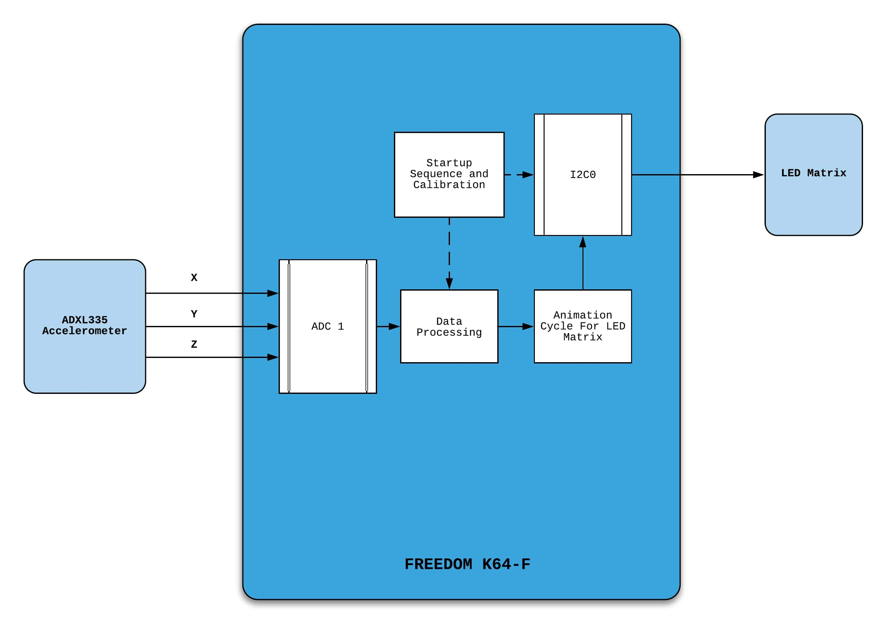
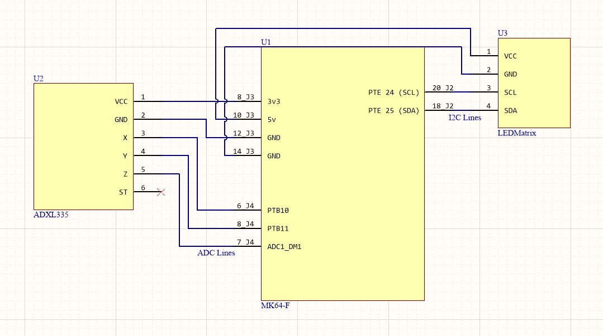
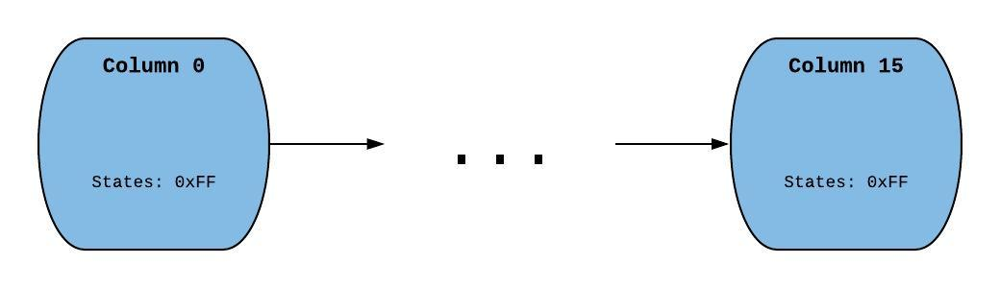

# Tremor-Detector-FRDM-K64F
Accelerometer based Tremor Detector and Visualizer on FRDM-K64F development board. This is a the final project report for the project.

### <b>iHeart Embedded: Project Report</b>

#### Introduction

iHeart Embedded is an accelerometer-based tremor detector with a visualization module implemented using a LED matrix. The LED matrix displays a real-time moving line graph of the magnitude of tremor detected. The graph animates and scrolls from left to right. An example application of the device is the detection of seismic activity in locations that experience frequent seismic activity. The original intent of the project was to use the accelerometer to detect a heartbeat. Various problems occurred that prevented this from happening. The detection of a heartbeat requires fast sampling rates which the board might not have been able to handle. Heartbeat detection accelerometers function better if they are wireless since wires provide enough restoring force to significantly dampen the reading of the heartbeat. Additionally, noise filtering is an important aspect of getting sensor readings that are accurate enough to read heartbeats. There seems to be a significant amount of capacitive coupling between the external accelerometer, breadboard, and MK64F microcontroller. This lead to noisy data at times which prevented an accurate reading of something as small timescale as a heartbeat. The device is still suitable if calibrated correctly, to pick up footsteps of people walking in the room, and measure data from a user's breathing or detect any oscillatory motion. The accelerometer used is ADXL335 from Analog Devices[1]. The LED matrix used is the 16x8 1.2" LED Matrix and Backpack from Adafruit[2]. Drivers all the devices used are written from scratch. I2C drivers are provided via the I2C demo on canvas[3].
 
#### System Overview

The block diagram below provides a summary of how this system functions. Overall, three ADC pins and one I2C module is used.

A more detailed schematic is shown later in the Next Section.

#### System Description

A schematic of the system is given below. The pins and headers can be found in the MK64-F User Manual[4].

The system is organized into two main modules; reading the input of the ADXL335 and animating the LED Matrix. The ADXL335 accelerometer has a VDD of 3V3, and there are three separate outputs for X, Y, and Z accelerations, so three ADC pins must be used. The pins used are PTB10, PTB11, and ADC1_DM1. These pins on the header as shown above and are connected internally to the board's ADC1 module. The default usages for the pins are all set to their analog inputs therefore no internal MUXing needs to be done. When the ADC conversion is called, the analog signal is read in as a 16-bit value. Zero acceleration is determined experimentally for each pin separately. Values for 0g are around 215 for each direction. Scalings for 1g are also measured in each direction assuming a linear relationship between voltage levels and acceleration. This is a reasonable assumption given the data sheet of the ADXL335[5]. Knowing both these values allows easy conversion between the 16-bit values being read from the accelerometer and the g-force experience by the physical system.
 
 
The LED matrix uses the HT16K33 driver chip which runs on 5V VDD and uses I2C communication[6]. The I2C0 module on the MK64-F is used for this purpose. PTE24 and PTE25 are used as SCL and SDA lines. The ADAFRUIT Arduino library for the matrix is used as a reference to understand the memory addressing[7]. The I2C encoding for the chip uses both 1-byte and 2-byte instructions. The 1-byte instructions are for initializing the chip. To initialize the LED matrix, signals must be sent to turn on the internal oscillator, set the brightness of the LEDs, set the blink-rate of the display (frequency of the LED's flashing), and clear all the LED's initial values. Memory on the HT16K33 is non-volatile, so the previous state from before turning off the matrix is still stored in the LED matrix. Turning LEDs on and off for the chip requires 2-byte instructions and requires understanding the addressing of the LEDs on the matrix. Registers are addressed by row from 0x00 to 0x0F. Even though there are 16 addresses, there are only 8 rows. 0x00 stores the state for the first 8 LEDs of the first row. 0x01 stores the last 8 LEDs of the first row and so on. To write the LEDs' states, the first byte of data is the register's address, and the second byte is the states for the 8 LEDs in the half row where the LSB is the state for the rightmost LED in the half row while the MSB is the state for the leftmost LED in the half row. 0 is off while 1 is on. To update the entire display, a length 16 display buffer is made up of 16 8 bit values. When this buffer is looped through, each value at index "i" represents the LED states for the memory address "i".
 
 
This LED buffer is not convenient for storing and displaying the LED values in a way that is intuitive to animate. The awkward half-rows that are stored in the display buffer would be hard to move across the screen, because the animation should consist of moving columns. In order to animate the LED matrix with a line graph, each column of the LED matrix must represent the reading from the accelerometer across a specific timeframe. A value baseline reading of 0g force is displayed with a flatline by always lighting up the 3rd LED from the bottom in each column. A linked list with length 16 is made to represent the display state of the LED matrix. Each node represents a column and contains the state of the LEDs in that column as a char array of 0's or 1's, along with a pointer to the next column as shown below. The first value in the array represents the state for the top LED in the specific column and so on. The char array below is shown as a hex number.

Every time the display is updated, a column is added to the head of the list, and a column is removed from the end of the list. The linked list must be converted to the array buffer format; a column-based format to a row-based format. This can be done with a recursive function that, for every row value in the array buffer, adds every necessary column bit-shifted by the correct amount to generate the row states.
 
 
The program itself uses the two modules mentioned above. First, a startup sequence is called which initializes every necessary module (I2C, ADC, LED-Matrix). Optionally, an accelerometer calibration function can be called which zeros the accelerometer to a static resting position chosen by the user. The accelerometer needs to be still for this sequence. A flatline image is displayed as the initial signal on the LED matrix. The program does not use the process state and instead uses a while(1) loop because the sequence of events that needs to be repeated is the exact same each time around. Each cycle, the values for the X, Y, and Z accelerations are read. The average magnitude of acceleration from the last 500 cycles (readings) is stored along with other possibly useful information. Because the results can be noisy, a threshold is set where if the magnitude exceeds some reasonable limit for a particular reading, the magnitude is set to 0 for that cycle. After 500 loops of taking accelerometer readings, the display is updated. The new column to be pushed to the display linked list is determined by a quantization function. Whether a magnitude is considered negative or positive is determined by the sign of a given axis of the accelerometer chosen by the user. For example, if tremor detected is expected to be along the Z-axis, the sign of the last 500 averaged Z accelerometer readings will be used as the sign of the magnitude. The quantization values can be set according to the application.

#### Testing

The code for the project was written iteratively. The first module tested was the ADC conversion. This required finding out which pins work most conveniently with the ADC1 module. Watch variables were set to make sure that the ADC was reading the values that were expected. 1g and 0g values were tested for all axis. If values were not reasonable, the wiring, clock gating, and pin MUXing were checked. If all else failed, the ADC was moved to another pin until 3 pins were found that worked. The debugger was used extensively across the entire testing process, as it allowed the testers to view the values stored in each variable to verify correct execution.
 
 
The next module tested was the LED matrix. I2C acknowledge flags were checked to make sure that the HT16K33 was receiving the signal. Blink rate and dimness were checked by setting the blink rate brightness of the LEDs to different levels and verifying correct behavior. Drawing specific shapes on the matrix made sure that the addressing used was correct. This was done by manually setting specific LED's to be on, and visually verifying that the correct shapes were displayed on the LED matrix. Animation for the Matrix was tested next. The correct behavior for pushing and popping a single column in the display is tested. This verified that the bit shifting and recursion used to convert columns to rows functioned correctly. A for loop then tested if continuously pushing and popping columns to and from the display worked properly.
 
 
The logic for the program structure was tested next. First, updating the Accelerometer readings (average magnitude, minimum acceleration, maximum acceleration) every cycle is tested. Values for many cycles were read to and manually inspected to make sure that data were consistent and accurate. A threshold to prevent noise was added as a result of coming upon values that deviated far from expected. The logic for updating the display every 500 cycles was then written and tested. Quantization levels were experimentally determined based on the desired sensitivity range. Activities like walking, jumping, etc. were performed to tested whether or not the matrix would change its readings based on the vibrations. Once correct behavior was verified, fine-tuning was done to attempt to correct for noise. This included different calibration techniques and precisely measuring default accelerometer values. Working with analog accelerometers proved difficult between two different builds of the project, because manufacturer inconsistencies caused default values to vary widely between boards along with scaling. This mean't that each system had to be calibrated separately in order to calculate g-force values.
 
 
Finally, different applications of the device were tested to test what kind of situations would work with the project. Some of these included monitoring breathing rate, tremors detected by walking around, attaching the accelerometer to a moving device, etc.
 
 
As a side note, in order to get this project detecting a heartbeat, a different wireless accelerometer would have to be used with higher resolution and less error.

#### Resources

<b>[1]</b> [ADXL335 Accelerometer](https://www.sparkfun.com/products/9269)
 
<b>[2]</b> [Adafuit 8x16 LED Matrix](https://www.adafruit.com/product/2035)
 
<b>[3]</b> [I2C Driver](https://github.coecis.cornell.edu/ece3140-sp2020/3140_accel)
 
<b>[4}</b> [Pins for MK64-F](https://os.mbed.com/media/uploads/GregC/frdm-k64f_ug_rev0.1.pdf)
 
<b>[5]</b> [ADXL335 Datasheet](https://www.analog.com/media/en/technical-documentation/data-sheets/ADXL335.pdf)
 
<b>[6]</b> [HT16K33 Datasheet](https://cdn-shop.adafruit.com/datasheets/ht16K33v110.pdf)
 
<b>[7]</b> [Arduino LED Matrix Driver](https://github.com/adafruit/Adafruit_LED_Backpack)
